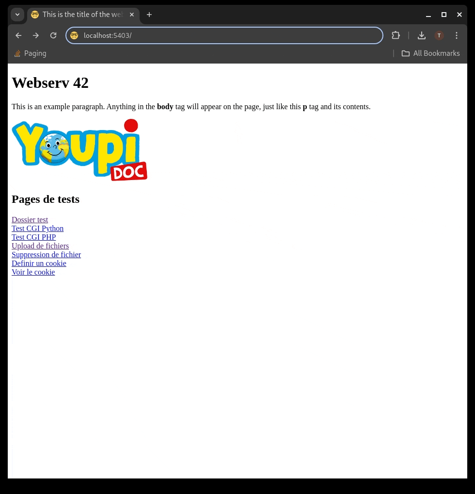

# Webserv: A HTTP Server in C++ 98

In this project, we implemented a HTTP server in C++ 98, designed to serve static websites, handle GET, POST and DELETE methods, manage uploads from clients and provide CGI support for php and python scripts. Of course, the server is non-blocking and compatible with at least Google Chrome and Mozilla Firefox. 



## Getting started:

```
git clone https://github.com/tgrasset/webserv.git
cd webserv
./webserv <path/to/config/file(optional)>
```

## Configuration:
Examples of configuration files can be found in the `./configs` folder.  
The program can be launched with several servers listening on different ports so you can have several `server{}` blocks in the configuration file.  
Here are some elements that can be defined for each `server` :
- `host` : the IP address of the server
- `listen` : the listening port
- `root` : the root directory of the server
- `index` : the page served if the root directory is requested by the client
- `client_max_body_size` : the maximum length in bytes of a request's body
- `error_page`: path of optional custom error pages for any http status code
- `server_name` : this field is only used to differentate 2 servers listening on the same IP/port pair

Each `server{}` block can include any number of `location{}` blocks associated to a specific route where some particular behaviours can be defined with the following keywords:
- `allow_methods` : lists the methods authorized for this route (GET, POST and DELETE)
- `index` : an index can be specified for any route and not just for the server
- `autoindex` : if no index page is provided, the server will generate an overview of the route's filesystem similar to the `ls` command in a shell context
- `upload_dir` : the directory where clients' uploaded file will be saved
- `return` : followed by a status code and a route, this keyword is for redirections

## Acknowledgements

This project was made with my teammate [lanzaj](https://github.com/lanzaj)
 at 42school.